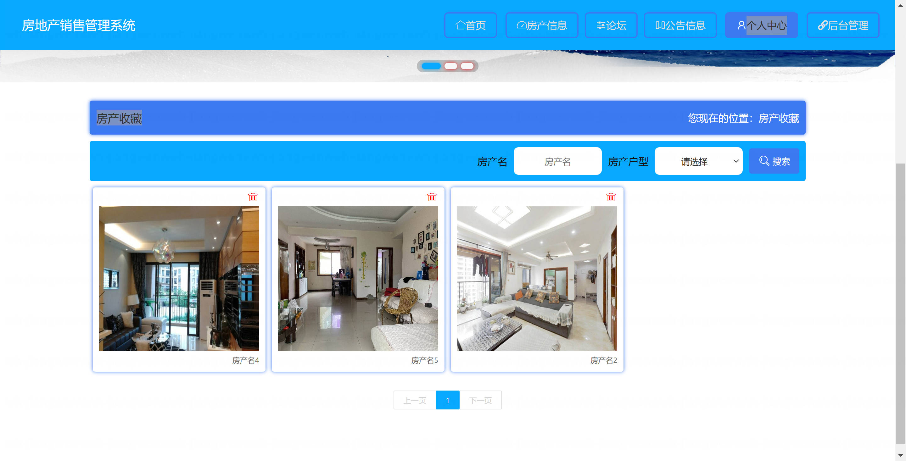

基于 Spring Boot 的房地产销售管理系统（程序+论文）
=

### 完整代码获取地址：从戎源码网 ([https://armycodes.com/](https://armycodes.com/))
### 作者微信：19941326836  QQ：952045282 
### 承接计算机毕业设计、Java毕业设计、Python毕业设计、深度学习、机器学习
### 选题+开题报告+任务书+程序定制+安装调试+论文+答辩ppt 一条龙服务
### 所有选题地址https://github.com/nature924/allProject

一、项目介绍
---

基于 Spring Boot 的房地产销售管理系统，系统角色为管理员、销售经理、客户，主要功能如下

管理员：
基本操作：登录、修改密码、获取/修改个人信息
用户管理：用户列表/筛选、新增、修改、删除、查看详情、重置密码、获取 session 用户信息
房产管理：房产列表/筛选/分页、查看详情、后台新增/修改/删除、、前端详情展示
收藏管理：查看/管理用户房产收藏、删除、前端收藏/取消收藏
预约管理：预约列表/管理、查看详情、删除、前端预约管理
论坛管理：帖子增删改查、查看详情（含级联用户/客户/员工信息）
购置记录管理：购置房产记录的增删改查
公告/配置管理：轮播图与系统配置（增删改查、按 name 查询）

销售经理：
基本操作：登录、修改密码、获取/修改个人信息
可查看/管理分配给自己的房产/预约/收藏/论坛等（后台列表带 role 过滤）
房产、预约、收藏、论坛 的新增/修改/查看/删除（受权限约束）

客户：
基本操作：注册、登录、修改密码、获取/修改个人信息
房产浏览：前端房产列表、详情查看
收藏：添加/查看/取消收藏
预约看房：提交预约、查看预约记录
论坛：发帖、查看帖子、评论（前端接口）

二、项目技术
---
- 编程语言：Java
- 数据库：MySQL
- 项目管理工具：Maven
- 前端技术：VUE、HTML、Jquery、Bootstrap
- 后端技术：Spring、SpringMVC、MyBatis

三、运行环境
---
- 操作系统：Windows、macOS都可以
- JDK版本：JDK1.8以上都可以
- 开发工具：IDEA、Ecplise、Myecplise都可以
- 数据库: MySQL5.7以上都可以
- Tomcat：任意版本都可以
- Maven：任意版本都可以

四、运行截图
---
### 论文截图：

### 程序截图：

